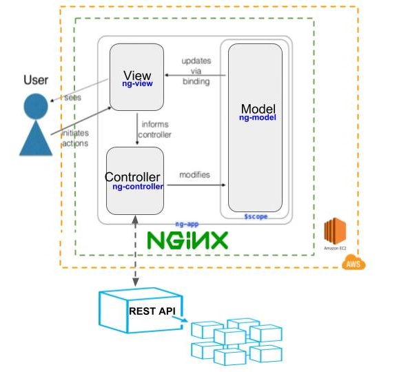
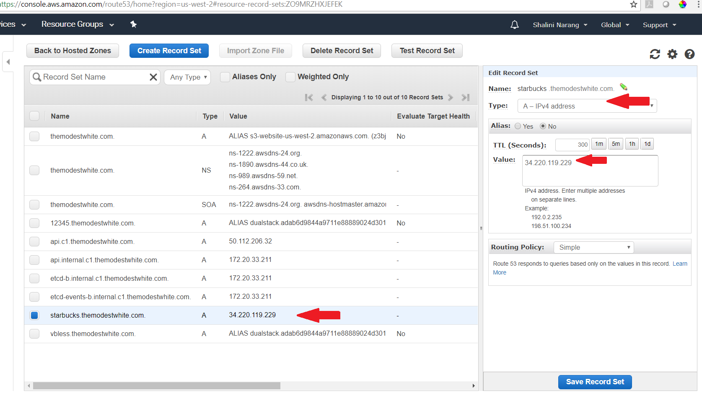
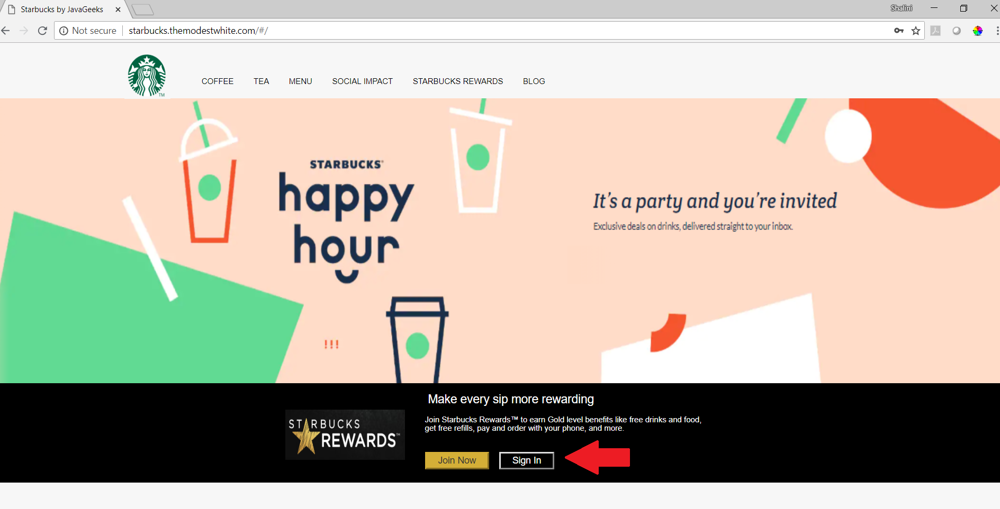
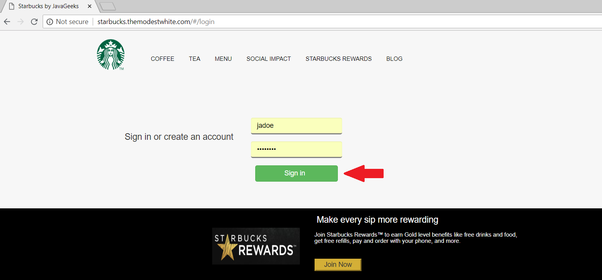
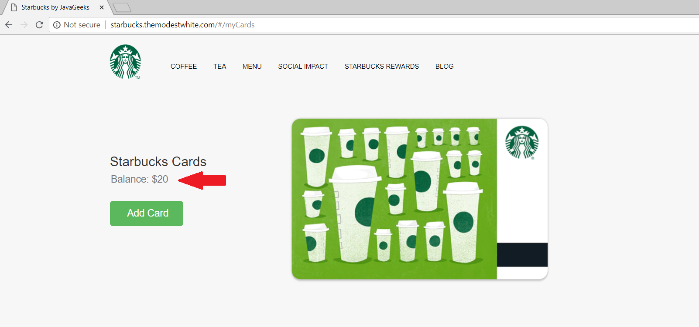
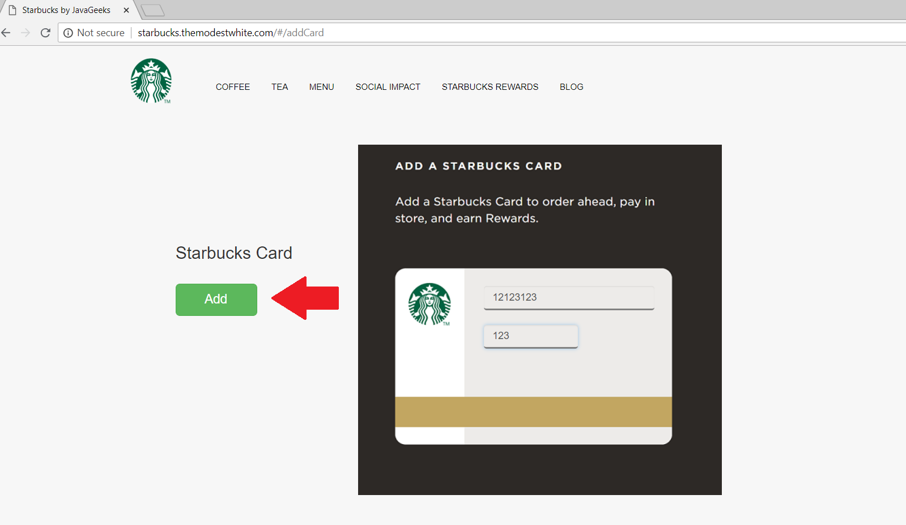
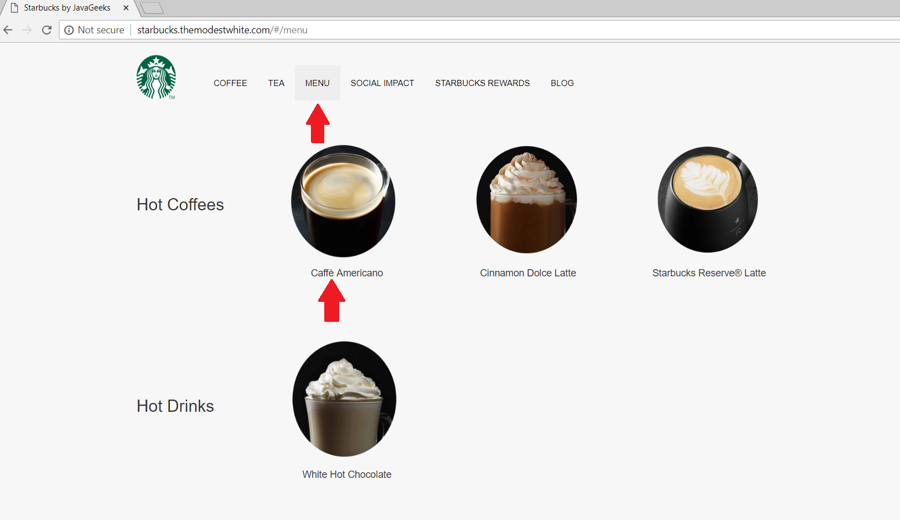
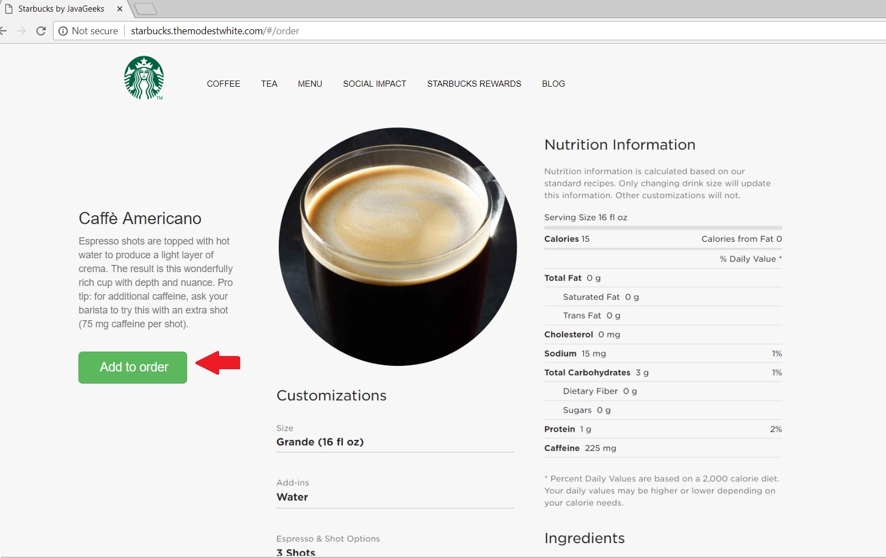
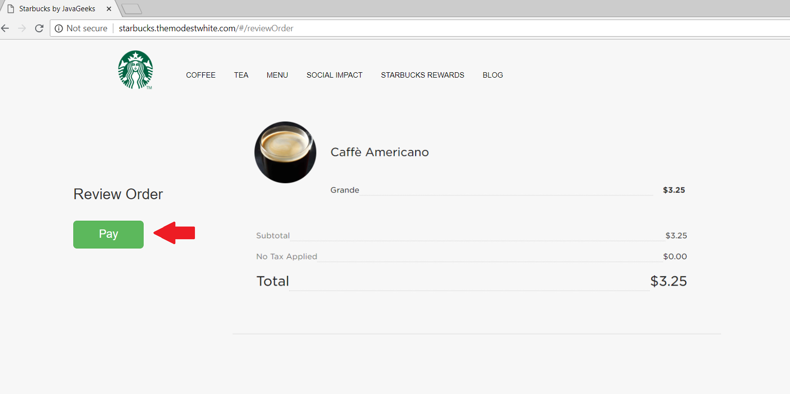

# About
This UI project is created to simulate the order processing at Starbucks using microservices. The UI facilitates the user to login, choose and order coffee. The user can add a Starbucks card and pay using the card. 

# Technologies used
1. Angular JS 1
2. HTML 
3. CSS
4. Bootstrap

# Architecture diagram

# Setup Instructions
## Local Installation
1. Git clone the repository
2. Edit viewModels/controller.js and provide the correct microservice URL for each microservice to be invoked
3. Execute command on the command prompt npm install simple-autoreload-server -g
4. Execute command on the command prompt autoreload-server
5. Access UI http://localhost:8080/index.html

## Cloud Installation (AWS EC2)
1. Provision a new EC2 instance and use the following AMI Canonical, Ubuntu, 16.04 LTS
2. ssh to the ubuntu instance and install ngnix using following URL - https://www.nginx.com/blog/setting-up-nginx/
3. Git clone the repository 
4. Follow the instructions "Setting Up Sample Files" from https://www.nginx.com/blog/setting-up-nginx/ to setup the UI server
5. Route 53 can be configured to the desired DNS name. Following screen shot depicts the properties to be set.

# Screenshots
1. Following screenshot depicts the home page. The user can click on "Sign In" to navigate to the login screen.

2. A registered user can sign-in by providing user name and the password.

3. A logged in user is taken to the My Cards screen where the user can view his available card balance.

4. A user can click on add card to add a new card. The add card screen is depicted in the following screenshot.

5. On clicking Menu the user is shown the menu item as follows:

6. Upon selecting an item, the user is taken to the order page, where he can order coffee by clicking Add to Order button.

7. Once order is conformed the user is taken to Payment screen as follows, where he makes the payment.

